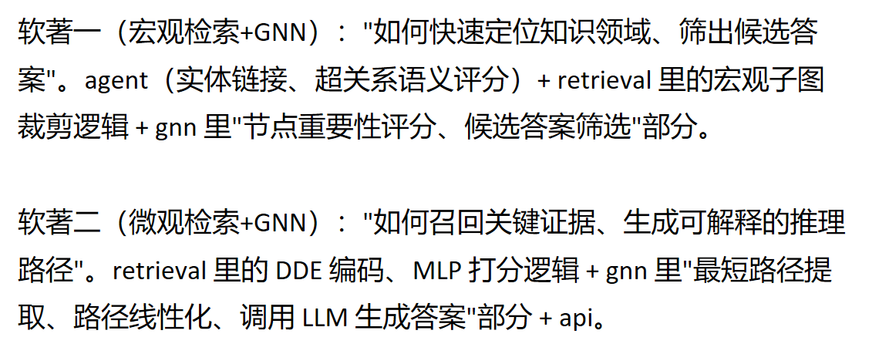

# 融合LLM Agent与图神经推理的KGQA系统 —— 模块接口文档 v0.1


---

## 0. 全局约定

| 项 | 说明 |
|---|---|
| 实体 ID | `entity_id`，字符串，如 `"Q1024"` |
| 关系 ID | `relation_id`，字符串，如 `"R017"` |
| 三元组 | `[head_id, relation_id, tail_id]` 三元数组 |
| 问题 ID | `question_id`，每次问答的唯一标识，贯穿全流程，便于调试和日志追踪 |
| 分数 | 统一为 `float`，范围 `[0, 1]` |
| 版本号 | 每个接口 JSON 顶层带 `"schema_version": "0.1"`，后续改动升版本号，避免联调时互相猜字段 |

---

## 1. 宏观检索模块 → 微观检索模块

**接口名：`macro_subgraph`**（由 agent + retrieval宏观部分产出）

```json
{
  "schema_version": "0.1",
  "question_id": "q_0001",
  "question_text": "阿司匹林和布洛芬同时服用会有什么风险？",
  "topic_entities": ["Q1024", "Q1088"],
  "selected_hyper_relations": [
    {"relation_id": "HR03", "label": "药物相互作用", "score": 0.92},
    {"relation_id": "HR07", "label": "禁忌症", "score": 0.81}
  ],
  "macro_subgraph": {
    "nodes": [
      {"entity_id": "Q1024", "label": "阿司匹林", "is_topic": true},
      {"entity_id": "Q1088", "label": "布洛芬", "is_topic": true},
      {"entity_id": "Q2031", "label": "胃肠道出血", "is_topic": false}
    ],
    "triples": [
      ["Q1024", "R017", "Q2031"],
      ["Q1088", "R017", "Q2031"]
    ]
  },
  "max_hops": 3
}
```

**字段说明**
- `topic_entities`：实体链接消歧后的主题实体，微观/GNN模块后续都要用这个集合。
- `selected_hyper_relations`：宏观语义锚点，仅供日志/可解释性展示用，微观检索**不强制**依赖这个字段做过滤（避免过度耦合，微观自己有一套并行评分逻辑）。
- `macro_subgraph.triples`：约束BFS裁剪后的候选三元组全集，微观检索模块的输入就是这个列表，不需要再重新访问原始大图。

---

## 2. 微观检索模块 → GNN推理模块

**接口名：`micro_evidence_subgraph`**（由 retrieval微观部分产出，含 DDE + MLP 打分结果）

```json
{
  "schema_version": "0.1",
  "question_id": "q_0001",
  "evidence_triples": [
    {
      "triple": ["Q1024", "R017", "Q2031"],
      "relevance_score": 0.88,
      "dde": {
        "head_dde": [0.1, 0.0, 0.3, 0.0],
        "tail_dde": [0.0, 0.2, 0.0, 0.4]
      }
    },
    {
      "triple": ["Q1088", "R017", "Q2031"],
      "relevance_score": 0.81,
      "dde": {
        "head_dde": [0.0, 0.1, 0.2, 0.0],
        "tail_dde": [0.0, 0.2, 0.0, 0.4]
      }
    }
  ],
  "top_k": 20,
  "node_features": [
    {"entity_id": "Q1024", "text_embedding_id": "emb_Q1024"},
    {"entity_id": "Q2031", "text_embedding_id": "emb_Q2031"}
  ]
}
```

**字段说明**
- `evidence_triples`：按 `relevance_score` 降序排列的 Top-K 三元组，GNN 模块直接拿这个列表建子图，不再重新计算结构特征。
- `dde`：有向距离编码，按你项目书里"入边/出边多轮均值传播拼接"的定义产出定长向量，GNN 侧作为节点初始特征的一部分（和 BERT 嵌入拼接）。**这里先约定维度和拼接顺序，微观检索组和 GNN 组务必对一次实际的向量长度**，避免联调时维度对不上。
- `node_features.text_embedding_id`：不直接传大向量，传一个 embedding 索引/文件路径，实际向量走共享的向量库（llm 模块统一管理），减少 JSON 体积。

---

## 3. GNN推理模块 → LLM生成

**接口名：`gnn_reasoning_output`**（由 gnn/scoring + gnn/pathgen 产出）

```json
{
  "schema_version": "0.1",
  "question_id": "q_0001",
  "candidate_answers": [
    {"entity_id": "Q2031", "label": "胃肠道出血", "prob": 0.76},
    {"entity_id": "Q2099", "label": "肾功能损伤", "prob": 0.41}
  ],
  "reasoning_paths": [
    {
      "answer_entity_id": "Q2031",
      "path": [
        {"entity_id": "Q1024", "label": "阿司匹林"},
        {"relation_id": "R017", "label": "增加风险"},
        {"entity_id": "Q2031", "label": "胃肠道出血"}
      ],
      "path_score": 0.83
    }
  ]
}
```

**字段说明**
- `candidate_answers`：两层 R-GCN + softmax 后取 Top-10（示例里只放 2 条），供 LLM 生成阶段参考，也可以单独展示在前端"候选答案"面板。
- `reasoning_paths`：双向 BFS 得到的最短路径，实体和关系交替出现，`path` 数组长度恒为奇数（首尾都是实体）。这是前端展示"可解释推理链"的直接数据源，也是喂给 LLM 生成最终自然语言答案的输入。

---

## 4. 前端展示 / 调度层需要的最小字段

前端不需要理解 DDE 向量这些内部细节，简单页面只需要从上面三份接口里各拿一部分拼一个"问答结果卡片"：

```json
{
  "question_id": "q_0001",
  "question_text": "阿司匹林和布洛芬同时服用会有什么风险？",
  "final_answer": "同时服用可能增加胃肠道出血风险……",
  "macro_hyper_relations": ["药物相互作用", "禁忌症"],
  "top_candidates": ["胃肠道出血", "肾功能损伤"],
  "explain_path": "阿司匹林 →(增加风险)→ 胃肠道出血"
}
```


